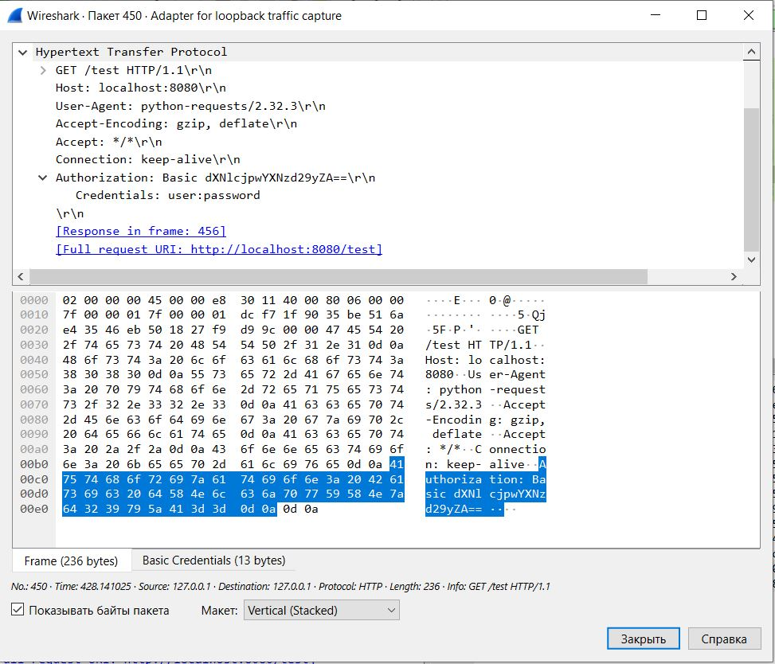
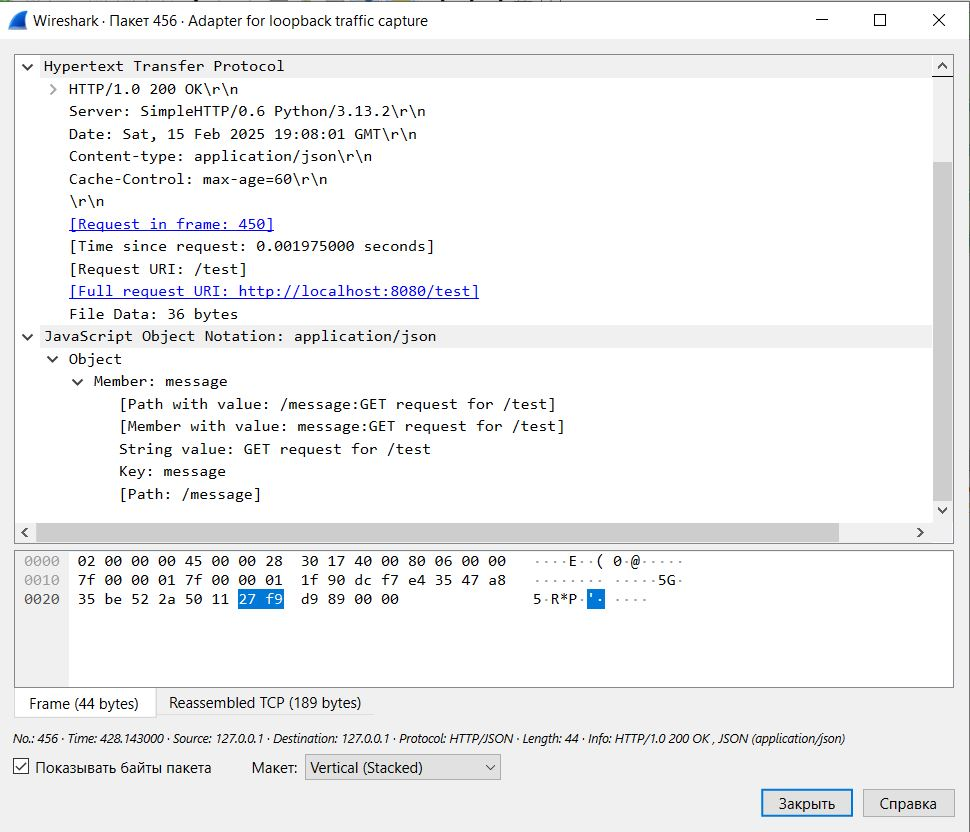
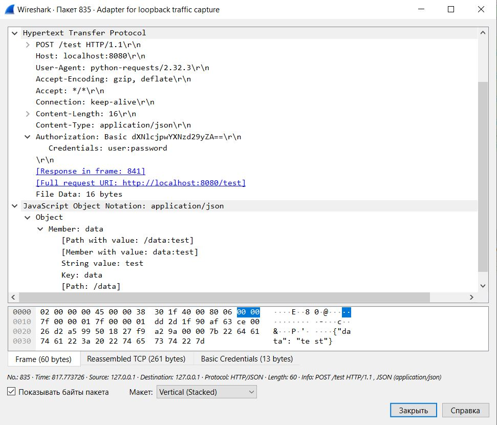
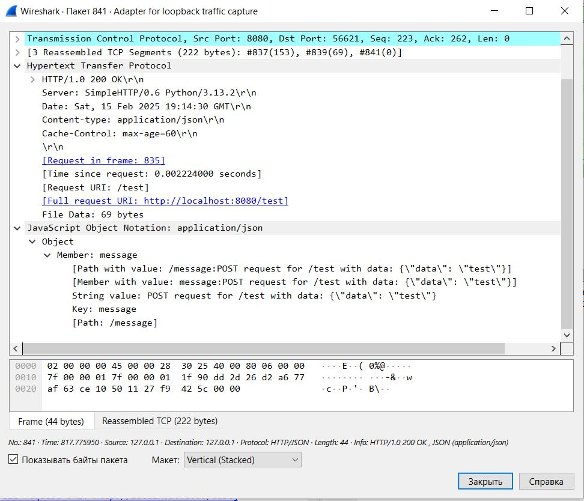
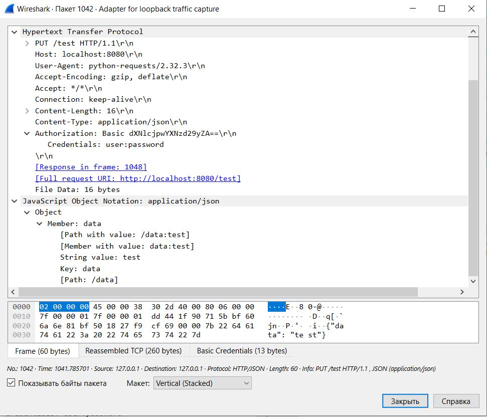
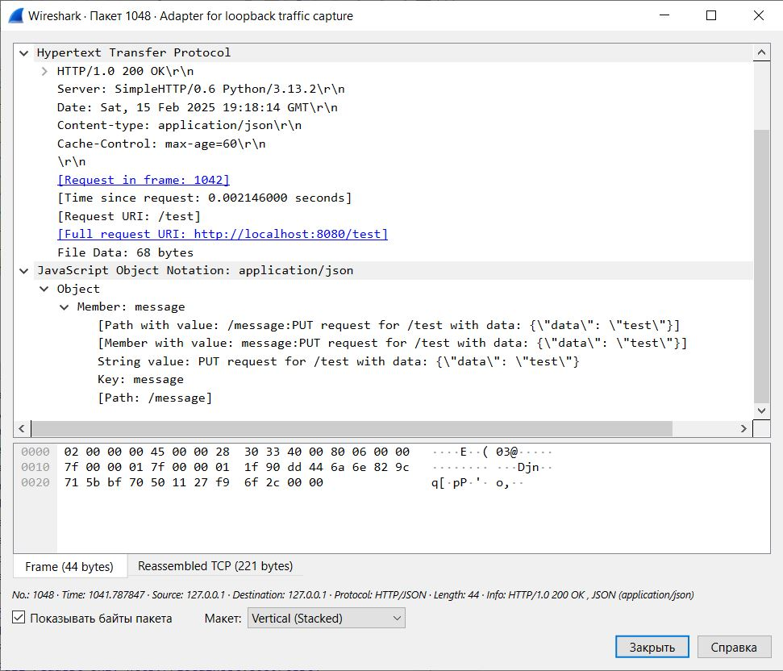
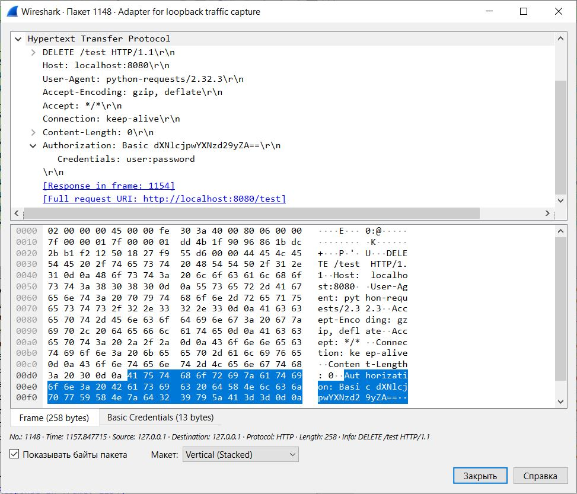
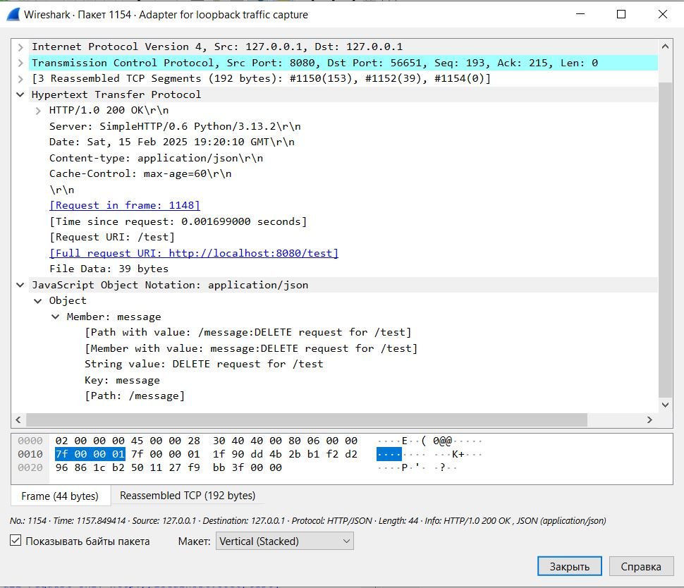
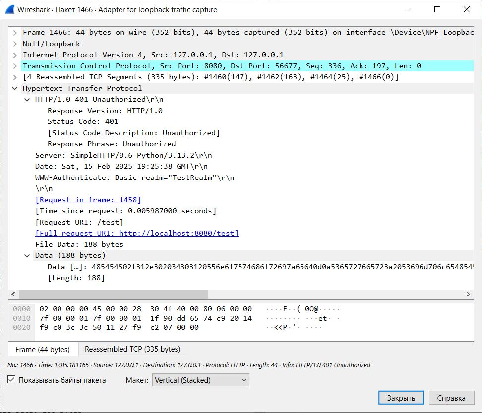

# Анализ HTTP-трафика

## GET

Запрос

Ответ

## POST

Запрос

Ответ

## PUT

Запрос

Ответ

## DELETE

Запрос

Ответ

## Пример ответа с ошибкой аутентификации

По умолчанию установлены следующие учетные данные:
- username: user
- password: password

Меняем username на bad_user

Ответ от сервера

